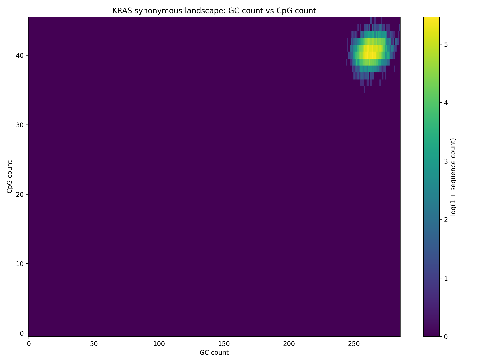

# KRAS synonymous sequence landscape

This repository explores the nucleotide-sequence landscape of a KRAS coding
sequence while preserving its encoded protein. It uses a JAX-accelerated
evolutionary algorithm to sample synonymous codon variants whose CpG or GC
counts fall near a requested interval, then combines one or more runs into a
two-dimensional CpG-by-GC density map.

> [!IMPORTANT]
> The current pipeline generates synonymous candidate sequences in memory but
> saves only their final **CpG and GC counts**. It does not yet write the
> nucleotide sequences themselves.

## Workflow

```text
KRAS CDS
  -> synonymous codon choices at every position
  -> random population of synonymous variants
  -> selection and mutation toward a CpG or GC target interval
  -> compressed per-candidate metric arrays (.npz)
  -> aggregate density matrix, plot, CSV, and summaries
```

The bundled [`data/principal_sequence.txt`](data/principal_sequence.txt) is a
567-nucleotide CDS (189 codons including the terminal stop codon). For every
codon position, the generator looks up all codons encoding the same amino acid.
Consequently, every generated candidate has the same translated amino-acid
sequence as the input CDS.

At each generation, the algorithm:

1. counts either CpG dinucleotides or G/C nucleotides in every candidate;
2. ranks candidates by their distance from an inclusive target interval;
3. samples parents from the highest-ranking elite fraction; and
4. randomly replaces codon choices at positions selected by the mutation rate.

The requested interval is a selection target, not a hard output filter. The
saved final population can contain metric values just outside the interval,
particularly because mutation occurs after selection.

## Requirements

- Python 3
- [JAX](https://docs.jax.dev/en/latest/installation.html)
- NumPy
- Matplotlib

The repository does not currently include a pinned dependency file. A minimal
CPU-only setup is:

```bash
git clone https://github.com/nucleo-jay/kras_t_seq_mapping.git
cd kras_t_seq_mapping

python -m venv .venv
source .venv/bin/activate
python -m pip install --upgrade pip
python -m pip install "jax[cpu]" numpy matplotlib
```

For NVIDIA GPU execution, install the JAX build appropriate for the local CUDA
driver and toolkit by following the linked JAX installation guide. The scripts
use whichever JAX device is available. You can inspect the selected device and
run a simple matrix-multiplication check with:

```bash
python scripts/gpu_smoke_test.py
```

Run the commands below from the repository root. Using `python -m` for the
generator ensures that the local `data` module can be imported correctly.

## Generate a metric batch

This small example evolves 10,000 synonymous variants toward 40–42 CpG sites:

```bash
python -m scripts.cpg_script \
  --cds data/principal_sequence.txt \
  --population-size 10000 \
  --generations 50 \
  --elite-fraction 0.05 \
  --mutation-rate 0.02 \
  --bin-low 40 \
  --bin-high 42 \
  --target-metric cpg \
  --seed 42 \
  --output-dir outputs/metrics_batches
```

Use `--target-metric gc` to select on total GC count instead. Both CpG and GC
counts are saved regardless of which metric drives selection.

The output name records the selected metric, target interval, and random seed:

```text
outputs/metrics_batches/metrics_cpg_040_042_seed42.npz
```

Each compressed NumPy archive contains:

| Key | Meaning |
| --- | --- |
| `cpg_counts` | One CpG dinucleotide count per final candidate |
| `gc_counts` | One total G/C nucleotide count per final candidate |
| `target_metric` | Selection metric: `cpg` or `gc` |
| `bin_low`, `bin_high` | Inclusive selection target |
| `seed` | JAX pseudorandom seed |
| `population_size` | Number of candidates |
| `generations` | Number of evolutionary steps |
| `mutation_rate` | Per-codon mutation probability |
| `elite_fraction` | Fraction retained for parent selection |

The default population is 100,000 candidates. Start with a smaller value to
check memory use and JAX compilation on a new machine.

### Run multiple target intervals

Independent runs can populate different parts of the landscape. For example:

```bash
for low in $(seq 10 5 50); do
  high=$((low + 4))
  python -m scripts.cpg_script \
    --cds data/principal_sequence.txt \
    --population-size 100000 \
    --generations 50 \
    --bin-low "$low" \
    --bin-high "$high" \
    --target-metric cpg \
    --seed "$low" \
    --output-dir outputs/metrics_batches
done
```

These runs are independent; using distinct seeds avoids repeating the same
initial pseudorandom population.

## Build the 2D landscape

Aggregate every matching metric batch and plot GC count on the x-axis versus
CpG count on the y-axis:

```bash
python -m scripts.map_2d \
  --input-dir outputs/metrics_batches \
  --pattern 'metrics_*.npz' \
  --output-dir outputs/map_2d
```

By default, the matrix bounds are inferred from the data. `--max-cpg` and
`--max-gc` can impose explicit bounds; candidates outside those bounds are
reported as invalid and omitted from the matrix.

The aggregation step writes:

| File | Contents |
| --- | --- |
| `density_map_2d_gc_x_cpg_y.npz` | Dense `uint64` matrix indexed as `[cpg_count, gc_count]` |
| `density_map_2d_gc_x_cpg_y.png` | Heatmap colored by `log(1 + sequence count)` |
| `density_map_2d_nonzero_bins.csv` | Occupied `(cpg_count, gc_count, density)` bins |
| `density_map_2d_summary.json` | Aggregate dimensions and sequence totals |
| `density_map_2d_file_summaries.jsonl` | Per-batch count ranges and means |

An example generated from the included 10,000-candidate batch is already in
[`outputs/map_2d_test`](outputs/map_2d_test):



## Input assumptions and interpretation

- Input text is uppercased, and characters other than `A`, `C`, `G`, and `T`
  are discarded.
- The cleaned CDS length must be divisible by three.
- Internal stop codons are rejected. A terminal stop codon is retained and can
  be synonymously recoded among stop codons.
- CpG count is the number of adjacent `CG` dinucleotides, including pairs that
  cross codon boundaries.
- GC count is the total number of `G` and `C` nucleotides.
- Codon choice changes are synonymous only; this code does not model amino-acid
  substitutions, indels, codon usage, expression, RNA structure, or fitness.
- A seed makes a run reproducible for a fixed software/hardware environment,
  but results can differ across JAX versions or accelerator backends.

This is exploratory research code, not a clinical interpretation tool.

## Repository layout

```text
data/
  principal_sequence.txt   Input KRAS CDS
  tables.py                Standard genetic-code lookup
scripts/
  cpg_script.py            Synonymous population evolution and metric export
  map_2d.py                Batch aggregation and density-map generation
  gpu_smoke_test.py        JAX device and matrix-multiplication check
outputs/
  metrics_batches/         Example metric archive
  map_2d_test/             Example aggregate outputs
```
